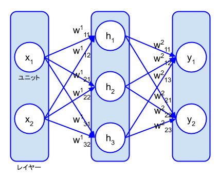
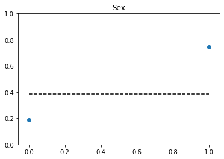

# なんとなく機械学習

+ **対象者:** 機械学習を知らない人
+ **ゴール:** 機械学習でできることがなんとなくわかる
+ **内容:** 機械学習の練習問題を解きながら考えたこととPythonの実装例を紹介（トレンドなのでディープラーニングを使う）。
学びはじめるのに何をしていいかすらわからない人がキーワードを拾うきっかけにしたり、機械学習を使いたい人が変な誤解をしていない状態を目指す。

+ **必須スキル**
  + 四則演算
  + FizzBuzz問題を解ける程度のプログラミング能力
+ **推奨スキル**
  + 高校数学
  + Pythonの知識
  + 英語（リーディング）

---

## ■ステップ0-A: Pythonの環境構築
詳しい解説はせず、Minicondaを使ったやり方だけを紹介。

### Minicondaを推奨
 + Linuxなどだとシステムで使うために最初から入っているPythonがあり、それと環境をわけるため
 + Pythonのバージョン管理やライブラリの管理が楽で、環境構築に失敗してもやり直しやすいため
 + Anacondaだとデフォルトで入っているライブラリが多すぎて容量が大きいため

### 手順
Minicondaをインストール https://docs.conda.io/en/latest/miniconda.html
```
$ source ~/.bashrc
$ conda create -n ml
$ conda activate ml
$ conda install python==3.6
$ pip install -r requirements.txt
```

## ■ステップ0-B: Kaggleの登録
Kaggleの練習課題「Titanic: Machine Learning from Disaster」を利用する。データのダウンロードに会員登録（無料）が必要。

### Kaggleとは
+ https://www.kaggle.com/
+ 機械学習のコンペをやっていたり機械学習について情報交換ができるサイト。
+ データサイエンスについて学べるコースもあるので本気で勉強したい人はそっちを推奨。

---

## ■ステップ1: 機械学習の基礎知識
### 機械学習とは
説明が難しいのでWikipediaから

> 機械学習では、センサやデータベースなどに由来するサンプルデータを入力して解析を行い、そのデータから有用な規則、ルール、知識表現、判断基準などを抽出し、アルゴリズムを発展させる。
（「機械学習」『フリー百科事典　ウィキペディア日本語版』。2019年11月10日 (日) 2時（日本時間）、URL: https://ja.wikipedia.org ）

これをもとに具体的に練習課題を見てみる。

### Titanic: Machine Learning from Disaster
タイタニックの乗客のデータからどのような人が生き残るかを予測する課題。

+ 「データベースなどに由来するサンプルデータ」 = タイタニックの乗客データ（性別、年齢、チケット料金など）
+ 「解析を行い、そのデータから有用な規則、ルール、知識表現、判断基準などを抽出」= どのような属性の人が生き残るかを予測する

イメージとしては下の図のようになる。


しかし、計算機にこんな人間みたいな思考はできない。
実態は乗客データを数値ベクトルにして入力したとき、生存確率を出力する関数。
学習データに合わせて良い関数を見つけるのが機械学習でやること。


ちなみにこれは機械学習の中でも教師あり学習と呼ばれるもので、ディープラーニングは教師あり学習の中に数ある手法の一つ。
**決して機械学習 = ディープラーニングではない。**
教師あり学習では学習データにたして教師信号（上の例だと生存なら1、死亡なら0）を与えて学習する。

機械学習は大別すると教師あり学習・教師なし学習・強化学習の3つに分けることができ、その中にそれぞれ様々な手法がある。
~~俗世では機械学習やディープラーニングや機械学習モデルのことをAIと言ったりしておりかなり曖昧。~~

### 線形回帰におけるパラメータの最適化
ディープラーニングの前により簡単な手法として線形回帰を紹介。
具体例として前ででてきた概念に当てはめるだけで解法など詳しい解説は省略。

#### モデル


入力Xは(データ数)×(属性数)の行列。
A、Bはパラメータ。

#### 最適化
学習データをX’、その教師信号をY’とすると誤差Eは以下のようになる。


ここでX’・Y’は定数、A・Bは変数になっており、このEを最小にするためのA・Bを求める。
線形回帰の場合は最小二乗法で求めることができる。
+ E2にたいしてA、Bでそれぞれ偏微分（∂E2/∂A、∂E2/∂B）
+ ∂E2/∂A=0、∂E2/∂B=0とおき、連立方程式を解く
+ A=Cov(X’, Y’) / Std(X’)2、B=Mean(Y’) - A・Mean(X’)が得られる
 + Covは共分散、Stdは標準偏差、Meanは平均

これでパラメータA、Bを学習データX’、Y’から得られたことになり、モデルが完成する。

線形回帰の場合、パラメータA・Bを解析的に求めることができる。
しかしモデルが単純すぎるので表現力に限界があり難しいタスクを解くことはできない。

### ディープラーニング
ニューラルネットワークという、より複雑で表現力の高いモデルを用いる。
その分パラメータ数も多いため、学習には大量のデータが必要になる。
**予測誤差を小さくするためにパラメータを最適化するのは線形回帰と同じ。**

#### モデル
ニューラルネットワークは下の図のように表すことが多い。



図のそれぞれの丸ををユニットと呼び、一つの数値を表す。またユニットの集まりをレイヤーと呼ぶ。

これも矢印がパラメータになっており一つの関数を表す。
例えば、ユニットh<sub>1</sub>の入力は以下の式を表している。


さらにユニットh<sub>1</sub>の出力時には活性化関数φが適用される。
すなわち、


この活性化関数には様々な非線形関数が使われる。
よく使われるのはシグモイド関数やReLU関数など。
同じレイヤー内では基本的に同じ活性関数を使うが、異なるレイヤーでは別々の活性化関数を使うこともある。

ユニットh<sub>2</sub>、h<sub>3</sub>、さらに出力ユニットy<sub>1</sub>、y<sub>2</sub>についても同様に計算できる。

ニューラルネットワークでは、ユニット数やレイヤー数を増やすことでモデルを更に複雑にすることができる。
図では3レイヤーだが、実際にはもっと多くのレイヤーを使う（画像分類では50層くらい）。
このようにレイヤーが深いモデルを用いるので、ディープラーニングと呼ばれる。

### 最適化
キーワードだけ紹介して詳しい解説は省略。

中身は複雑だが結局はY=f(X | θ)になっており、やることは線形回帰と同じく誤差の最小化を行う。

ただしモデルが非線形で複雑なため、最小二乗法は適用できない。そこで勾配法を用いる。

勾配法ではパラメータを以下の計算で更新する。
Lは損失関数を表し、最小化する目的の関数（例えば二乗誤差ならL=E<sup>2</sup>など）。
εは学習率を表し、一回の更新でパラメータをどの程度変えるかを調整する。


ニューラルネットの複雑なモデルの勾配∂L/∂θを求める手法として誤差逆伝播法を使う。
**このパラメータ更新を大量の学習データで繰り返し行うことによって、ニューラルネットワークの複雑なモデルを学習する。
そのため、ディープラーニングでは長い学習時間が必要になる。**

---

## ■ステップ2: データを見てみる
今回は練習問題を使っているので解けそうなのはわかっているし、手法もディープラーニングで決め打ちしているが、実際の問題では機械学習が適用できるか・どういった手法が適しているかをまず考えなければならない。
そのため**最初にデータを見て中身を可視化するのは超重要である。**

check_data.ipynbを参照。

### データのダウンロード
https://www.kaggle.com/c/titanic/data からtrain.csv・test.csvをダウンロードする。
+ train.csv
 + 学習データ。タイタニックの乗客の属性と**教師信号**（生き残ったかどうか）が書いている。
+ test.csv
 + テストデータ。乗客の属性のみが書いてあり、モデルを作ってこれらの乗客が生き残ったかどうかを予測する。

kaggleのページに詳しく書いているが、データの属性は以下の通り。
+ survival: 1=生存 0=死亡
+ name: 名前
+ pclass: チケットのクラス(1=1st(upper) 2=2nd(middle) 3=3rd(lower))
+ sex: 性別
+ age: 年齢（予測値の場合はxx.5の表記）
+ sibsp: 同乗した兄弟や配偶者の数
+ parch: 同乗した親や子供の数
+ ticket: チケット番号
+ fare: チケット料金
+ cabin: キャビン番号
+ embarked: 乗船港(C=Cherbourg Q=Queenstown S=Southampton)

### 基本情報の確認
データの解析にpandasというライブラリを使う。

pandasのinfo()という関数によりtrain.csvについて以下のようなことがわかる。
+ データ数は891、列数(属性)は12
+ name, sex, ticket, cabin, embarkedは数値型ではない
+ ageに177, cabinに687, embarkedに2の欠損がある

### 属性の選択
可視化にmatplotlibというライブラリを使う。
**機械学習は万能のツールに思われがちだが、余計な属性を含んでいるとノイズになってうまく学習できなかったり、
そもそも予測に必要な属性がなくどう頑張っても問題が解けないことがある。**

個人的には、学習に有効そうな属性にあたりをつけるためにはまずは人間ならどうやって予測するか考えるのがコツだと思う。
今回の問題だと自分の場合は以下のように考えた。
+ name: 生存/死亡には関係ないのでいらない
+ pclass: 富裕層のほうが助かりそうなので有効そう
+ sex: 女性の方が優先的に助かりそうなので有効そう
+ age: 子供のほうが優先的に助かりそうなので有効そう
+ sibsp: 同乗者と助け合うほうが助かりそうなので有効そう
+ parch: 同乗者と助け合うほうが助かりそうなので有効そう
+ ticket: 見ても単なる数値の羅列なのでいらない
+ fare: 高いチケットをもっている方が助かりそうなので有効そう
+ cabin: 役に立つかもしれないが欠損値が多すぎるので使わない
+ embarked: 恐らく役に立たないがよくわからない

ここまではほぼ勘なので実際にデータを見て確認することが重要。

ここでは生存率を確認。学習データ全体で見ると生存者数は342人なので、生存率は342 / 891 = 38.4%。
つまりデータを何も見ずに予測する場合は、とりあえず死亡と予測すれば6割くらい正解することがわかる。

続いて性別ごとの生存率を確認。下図は縦軸が生存率・横軸が性別（男性=0、女性=1）であり、男性はおよそ2割、女性はおよそ8割。

全体の生存率(図の点線)に対してそれぞれかなり差があり、生存かどうかを予測するのに性別はかなり有効な属性であることがわかる。



同じように他の属性についても確認すると以下のようなことがわかる。
+ pclass: 1stの生存率が6割と高い
+ sibsp: 一人・二人のとき38.4%よりやや高い（三人以上はデータ数が少なくなんともいえない）
+ parch: 一人・二人のとき38.4%よりやや高い（三人以上はデータ数が少なくなんともいえない）
+ fare: 70ドル以上は生存率が高い
+ age: 10歳以下の生存率が6割と高い
+ embarked: Cherbourgから乗った人の生存率が高い
以上より上記の属性については役に立ちそうなこともがわかる。地理的なことには詳しくないので理由はわからないが、一見あまり関係なさそうなembarkedも役に立ちそうな感じがする。

逆に、例えば名前にAが含まれる人などの生存率を見ても38.4%に近く、そのような特徴は生存かどうかを予測するにはあまり役に立たなさそうなことがわかる。
このような属性を学習に使っても効果がないか下手をすれば精度が下がる。

下図の横軸はアルファベットを表す（0:名前にAを含む人、1:名前にBを含む人, … 25:名前にZを含む人）。
16:Q・23:X・25:Zが高そうに見えるが、それぞれ10人・25人・44人とデータが少なくあまり当てにならないことに注意。


なお今回は一次元だけで見たが、属性を組み合わせることにより有効になる場合もあるので
今回のような可視化だけで全て判断できるわけではないことに注意。

### 欠損値の補完
欠損があるのはage, cabin, embarked。
cabinは使わないので無視。
embarkedは２つだけなのでほぼ影響はないと考え0埋め。
ageに関しては様々なやり方が考えられるが、今回はシンプルに中央値を利用。

### 標準化
データから平均を引き標準偏差で割ることによって、平均0・分散1のデータに変換。これは、データ同士の比較をするには実際の値ではなく、平均からどれだけ離れているかが重要だからである。ほとんどお約束みたいなもので、標準化を怠るとうまく予測できないことが多々ある。

---

## ■ステップ3: モデルを作って学習する
ステップ2でデータの準備ができたので、あとはモデルを作って学習する。
機械学習フレームワークにはTensorFlowに統合されたKeras APIを用いる。
モデルの作成はかなり高度な内容なので、詳しい解説はせず簡単に実装だけ紹介するが、どのようなモデルでも基本的にやることはステップ1で説明したようなパラメータの最適化である。

src/train.py他参照。

### バリデーションデータの準備
学習データの一部をバリデーションデータとして抽出。
パラメータの最適化には用いず、学習中のモデルが過学習していないか確認するために用いる。

#### 過学習
モデルが学習データの予測に特化しすぎてしまうこと。
モデルが複雑過ぎたり、学習データが少なすぎたりする場合に発生する。
このとき学習データで予測精度が高くても、バリデーションデータでは予測精度が著しく悪くなる。

### モデル
今回はユニット数8のレイヤー2つとユニット数1のレイヤー1つのニューラルネットワークを作成。
最後のユニットは生存確率を表し、活性化関数にシグモイド関数を使い0〜1の値を出力する。

ユニット数はいくつか試して良かったものを使った。
入力ベクトルの次元数や問題の難しさによって適切なニューラルネットのサイズは異なる。
基本的にユニット数を増やしたほうが精度はあがるが、処理が遅くなる・収束が遅くなったり収束しなかったりする・過学習するといった問題も起こりうる。

### 学習方法
学習率・損失関数・学習回数を設定して学習する。

#### 学習率
学習の成否に大きく影響する場合が多い。
学習率が大きすぎると損失が収束しないので、もしうまく学習できない場合はまず学習率を小さくしてみて様子を見るのが良い。
実装では省略したが、学習を進めるにつれて学習率を小さくしていくこともよく行う。

#### 学習回数
+ バッチサイズ
 + 1回のパラメータ更新で用いるデータ数
+ イテレーション
 + 1回のパラメータ更新
+ エポック
 + 学習データ全てを1回ずつ使ってパラメータ更新

例えばデータ数100・バッチサイズ4のとき、25イテレーションが1エポックになる。

実装では50エポック学習。
どれくらい学習すればよいかは基本事前にはわからないので、バリデーションデータの予測精度がほとんど変化しなくなったら止めるみたいなこともよく行う。

また、1エポックごとにチェックポイント（モデルのパラメータの途中結果）を保存している。
これは結果を保存する目的の他に、もし何らかの事情で学習が途中で止まってしまった場合にやり直せるようにする目的もある。
実装ではバリデーションデータの予測精度が一番高かったときのみ保存している。

### 学習
データをダウンロードしてtrain.pyを実行すると、エポックごとの学習データの精度・バリデーションデータの精度が表示され、50エポックで学習が完了する。データも少なく、モデルもとても小さいので恐らくすぐに完了する。

テストデータの予測結果はresult.csvに保存される。
Kaggleの投稿ページ(https://www.kaggle.com/c/titanic/submit )でアップロードすることで精度を確認できる。
自分の場合は0.78468で、およそ78%の精度でタイタニックの生存者を予測することができた。
環境によって多少の差はあると考えられるが、大体このくらいの精度になると思われる。

### オチ
ここで、別のモデルを考えてみる。

ステップ2で見たとおり、男性の生存率はおよそ2割・女性の生存率はおよそ8割である。
**つまり、男性は必ず死亡・女性は必ず生存と予測するとかなり高い正解率が期待できる。**

この学習も何もしていない超簡単なモデルによるテストデータの正解率は0.76555である
（自分で試したい人は https://www.kaggle.com/c/titanic/data のgender_submission.csvを投稿ページにアップロード）。

ディープラーニングで頑張ったモデルとの差は2％。
これを大きいととるか小さいととるかはタスクや目標によって異なる。
しかし、今回のテストデータは418人なので正解が8人増えただけと考えると、少なくとも自分はコストに見合わないと感じる。

機械学習の精度をあげる方法としては以下が考えられる。
+ 属性の前処理を頑張って学習しやすいようにする
+ モデルや損失関数を工夫する
+ 手法を変える
+ データを増やす
+ より有効な属性を増やす

例えばタイタニックの問題の場合、（海外なのでわからないが）名前は年によって流行や移り変わりがあったりするので、
年齢の欠損値を名前から正確に予測するみたいなことができれば精度をあげることができるかもしれない。
このあたりはやってみないとわからない。

一方で今回の性別だけで予測するモデルのように、より簡単な方法で予測できる可能性があることも心に留めておく必要がある。
データを用意してなんとなく機械学習すれば何か結果を返す関数をつくることはできる。
しかし上で見たとおり、**なんとなく機械学習・とりあえずディープラーニングでうまくいくというのは誤解である。**
もちろん、使い所を考えてデータを集めて適切な手法を選べば強力なツールとなりうる。

---

## ■まとめ
+ **ディープラーニングによるニューラルネットワークの学習には、基本的には行列データと教師信号が必要**
+ **データを可視化してしっかり考えるのは機械学習においても機械学習以外の解法を発見するのにおいても超重要**
+ **なんとなくで機械学習してもうまくいくわけではない**
