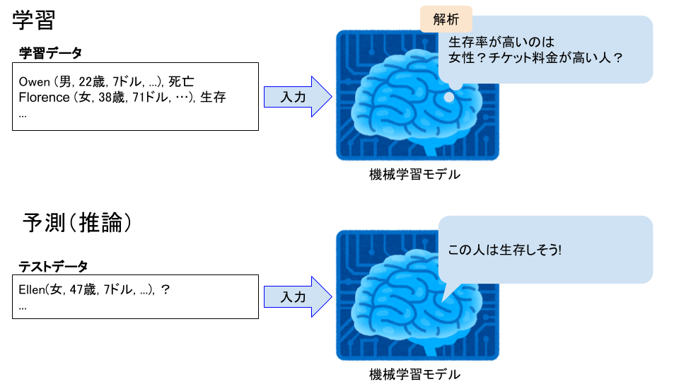

# ■ステップ1: 機械学習の基礎知識
## 機械学習とは
説明が難しいので、まずWikipediaから引用します。

> 機械学習では、センサやデータベースなどに由来するサンプルデータを入力して解析を行い、そのデータから有用な規則、ルール、知識表現、判断基準などを抽出し、アルゴリズムを発展させる。
（「機械学習」『フリー百科事典　ウィキペディア日本語版』。2019年11月10日 (日) 2時（日本時間）、URL: https://ja.wikipedia.org ）

これをもとに具体的に練習課題を見てみます。
練習課題としてはKaggleの「Titanic: Machine Learning from Disaster」を利用します。
後ほどデータのダウンロードにKaggleの会員登録（無料）が必要になります。

+ [Kaggle](https://www.kaggle.com/)とは
  + 機械学習のコンペをやっていたり機械学習について情報交換ができるサイト。
  + データサイエンスについて学べるコースもあるので、本格的に勉強したい人はそっちを推奨します。

この練習課題ではタイタニックの乗客のデータからどのような人が生き残るかを予測します。

Wikipediaの説明に当てはめると、

+ 「データベースなどに由来するサンプルデータ」→ タイタニックの乗客データ（性別、年齢、チケット料金など）
+ 「データから有用な規則、ルール、知識表現、判断基準などを抽出」→ どのような属性の人が生き残るかを予測

に相当します。

イメージとしては次の図のようになります。
機械学習モデルは、学習データからどのような属性の乗客が生き残りやすいかを解析し、未知のテストデータに対して生き残るかどうかを予測します。



しかし、計算機にこんな人間みたいな思考はできません。
機械学習モデルの実態は乗客データを数値ベクトルにして入力したとき、生存確率を出力する関数です。
**学習データに合わせて良い関数を見つける、すなわち関数のパラメータの最適化が機械学習でやることになります。**


ちなみにこれは機械学習の中でも教師あり学習と呼ばれるものです。
教師あり学習では学習データにたいして教師信号（上の例だと生存なら1、死亡なら0）を与えて学習します。
この教師あり学習の手法の一つに、最近トレンドのディープラーニングがあります。
**決して機械学習=ディープラーニングではありません。**

機械学習は大別すると教師あり学習・教師なし学習・強化学習の3つに分けることができ、その中にそれぞれ様々な手法があります。
興味のある方はまずこのあたりを勉強してみてください。

また、**AI（人工知能）は機械学習よりもっと上位の概念です。**
用語自体の厳密な定義は難しいですが、**AIを実現する方法は機械学習に限りません。**
つまり、概念が広い順にAI>機械学習>ディープラーニングです。
一緒くたに語られることが多いのであえてタイトルに「AI」をつけましたが、機械学習の話しかないこの資料にたいしては本来やや不適当かなと思います。

## 線形回帰
ディープラーニングの前に、より簡単な手法として線形回帰を紹介します。
詳しい解説は多くの書籍等が既にあるので、ここでは具体例として簡単に紹介するに留めます。

### モデル


入力Xは(データ数)×(属性数)の行列、
AとBは関数のパラメータになります。

### 最適化
学習データをX’、その教師信号をY’とすると誤差Eは以下のようになります。


ここでX’・Y’は定数、A・Bは変数になっており、このEを最小にするためのA・Bを求めます。
線形回帰の場合は最小二乗法で求めることができます。
+ E2にたいしてA、Bでそれぞれ偏微分（∂E2/∂A、∂E2/∂B）
+ ∂E2/∂A=0、∂E2/∂B=0とおき、連立方程式を解く
+ A=Cov(X’, Y’) / Std(X’)2、B=Mean(Y’) - A・Mean(X’)が得られる
 + Covは共分散、Stdは標準偏差、Meanは平均

これでパラメータAとBを学習データX’とその教師信号Y’から得られたことになり、モデルが完成します。

線形回帰の場合、パラメータA・Bを解析的に求めることができます。
しかしモデルが単純すぎるので表現力に限界があり、複雑なタスクを解くことは難しいです。

## ディープラーニング
ニューラルネットワークという、より複雑で表現力の高いモデルを用います。
その分パラメータ数も多いため、学習には大量のデータが必要になります。
**予測誤差を小さくするためにパラメータを最適化するのは線形回帰と同じです。**

詳しい解説は多くの書籍等が既にあるので、ここでも具体例として簡単に紹介するに留めます。

### モデル
ニューラルネットワークは次の図のように表すことが多いです。


図のそれぞれの丸ををユニットと呼び、一つの数値を表します。またユニットの集まりをレイヤーと呼びます。

これも矢印がパラメータになっており一つの関数を表します。
例えばユニットh<sub>1</sub>の入力では、x<sub>1</sub>とx<sub>2</sub>が矢印を通るときにそれぞれパラメータと積をとり、さらにその2つが入力されるところで和をとります。
すなわち次の式を表しています。


さらにユニットh<sub>1</sub>の出力時には活性化関数φが適用されます。
すなわち、次の式になります。


この活性化関数には様々な非線形関数が使われます。
よく使われるのはシグモイド関数やReLU関数などです。
同じレイヤー内では基本的に同じ活性関数を使いますが、異なるレイヤーでは別々の活性化関数を使うこともあります。

ユニットh<sub>2</sub>、h<sub>3</sub>、さらに出力ユニットy<sub>1</sub>、y<sub>2</sub>についても同様に計算できます。

ニューラルネットワークでは、ユニット数やレイヤー数を増やすことでモデルを更に複雑にすることができます。
図では3レイヤーですが、実際にはもっと多くのレイヤーを使います（画像分類では50層くらい）。
このようにレイヤーが深いモデルを用いるので、ディープラーニングと呼ばれます。

### 最適化
中身は複雑ですが、結局はY=f(X | θ)になっており、やることは線形回帰と同じく誤差の最小化を行います。

ただしモデルが非線形で複雑なため、最小二乗法は適用できません。そこで勾配法を用います。

勾配法ではパラメータを次の計算で更新します。
Lは損失関数で、最小化する目的の関数を表します（例えば二乗誤差ならL=E<sup>2</sup>など）。
εは学習率を表し、一回の更新でパラメータをどの程度変えるかを調整します。


ニューラルネットの複雑なモデルの勾配∂L/∂θを求める手法として誤差逆伝播法を使います。
**このパラメータ更新を大量の学習データで繰り返し行うことによって、ニューラルネットワークの複雑なモデルを学習します。
そのため、ディープラーニングでは長い学習時間がかかります。**

## まとめ
+ **機械学習でやることは関数のパラメータの最適化**
+ **概念が大きい順にAI>機械学習>ディープラーニング、ディープラーニングは機械学習の手法のひとつでAIは機械学習よりも広い概念**
+ **ディープラーニングをするには基本的に数値データと教師信号の組み合わせが大量に必要**

---

# ■ステップ2: データを見てみる
今回は練習課題を使っているので機械学習で解けることはほぼ自明で、手法も説明のためディープラーニングで決め打ちしています。
しかし、実際の問題では機械学習が適用できるか・どういった手法が適しているかをまず考えなければなりません。
そのため**最初にデータを見て中身を可視化するのは超重要です。**

## 開発環境(JupyterLab)
Pythonの環境構築については[Appendix](doc/APPENDIX.md)を参照してください。
JupyterLabの使い方がわかる人は飛ばしてください。

JupyterLabはPythonを書く際によく使われる開発環境です([公式サイト](https://jupyter.org/))。
コードをブロック単位で実行したり、文字列だけでなく画像を表示したりすることもできます。
ブラウザを通して使用するのでリモート環境でもよく使われます(Amazon Web Serviceの機械学習サービスSageMakerでも使われています)。

### 起動
次のコマンドを実行するとブラウザが立ち上がります。
```
$ cd path/to/root_of_this_repository
$ jupyter lab
```

### 使い方
+ 左のメニューからsrc/step2/check\_data.ipynbを開きます。
+ コードで実行したい箇所を選び、上部の再生ボタン（右向き三角）またはShift+Enterで選んだ箇所が実行されます。
+ はじめからやり直す場合はメニューバーのKernelからRestart Kernel...を選びます。
+ Markdownを書くこともできます。

その他は検索などで調べてくだい。

## データのダウンロード
[Kaggleのダウンロードページ](https://www.kaggle.com/c/titanic/data)からtrain.csv・test.csvをダウンロードし、リポジトリのdataディレクトリにいれてください。
+ train.csv
  + 学習データ。タイタニックの乗客の属性と**教師信号**（生き残ったかどうか）が書かれています。
+ test.csv
  + テストデータ。乗客の属性のみが書いてあり、モデルを作ってこれらの乗客が生き残ったかどうかを予測します。

Kaggleのページに詳しく書いていますが、データの属性は次の通りです。
+ survival: 1=生存 0=死亡
+ name: 名前
+ pclass: チケットのクラス(1=1st(upper) 2=2nd(middle) 3=3rd(lower))
+ sex: 性別
+ age: 年齢（予測値の場合はxx.5の表記）
+ sibsp: 同乗した兄弟や配偶者の数
+ parch: 同乗した親や子供の数
+ ticket: チケット番号
+ fare: チケット料金
+ cabin: キャビン番号
+ embarked: 乗船港(C=Cherbourg Q=Queenstown S=Southampton)

## 基本情報の確認
データの解析にpandasというライブラリを使います。

pandasのinfo()という関数によりtrain.csvについて次のようなことがわかります。
+ データ数は891、列数(属性)は12
+ object型の属性name、sex、ticket、cabin、embarkedがある
+ ageは714、cabinは204、embarkedは889しかデータがなく、それぞれ177、687、2の欠損がある

あとの処理で扱いにくいので、sexとembarkedは数値型に直します。
sexではmaleを0、femaleを1にします。
embarkedではCを1、Qを2、Sを3にします。

## 属性の選択
**機械学習は万能のツールに思われがちですが、余計な属性を含んでいるとノイズになってうまく学習できなかったり、
そもそも予測に必要な属性がなくどう頑張っても問題が解けないことがあります。**
そのため、学習に使う属性を取捨選択します。

私見ですが、学習に有効そうな属性にあたりをつけるためには自分ならどうやって予測するか考えるのがコツだと思います。
今回の問題だと、自分の場合は次のように仮説をたてました。
+ name: 生存/死亡には関係ないのでいらない
+ pclass: 富裕層のほうが助かりそうなので有効そう
+ sex: 女性の方が優先的に助かりそうなので有効そう
+ age: 子供のほうが優先的に助かりそうなので有効そう
+ sibsp: 同乗者と助け合うほうが助かりそうなので有効そう
+ parch: 同乗者と助け合うほうが助かりそうなので有効そう
+ ticket: 見ても単なる数値の羅列なのでいらない
+ fare: 高いチケットをもっている方が助かりそうなので有効そう
+ cabin: 役に立つかもしれないが欠損値が多すぎるので使わない
+ embarked: 恐らく役に立たないがよくわからない

ここまではほぼ勘なので実際にデータを見て確認します。
可視化にmatplotlibというライブラリを使います。

ここでは生存率を確認します。
学習データ全体で見ると生存者数は342人なので、生存率は342 / 891 = 38.4%です。
つまり属性を何も見ずに予測する場合は、とりあえず死亡と予測すれば6割くらい正解することがわかります。

続いて性別ごとの生存率を確認します。
次の図は縦軸が生存率・横軸が性別（男性=0、女性=1）で、男性はおよそ2割、女性はおよそ8割の生存率になっています。

全体の生存率(図の点線)に対してそれぞれかなり差があり、生存かどうかを予測するのに性別はかなり有効な属性であることがわかります。


同じように他の属性についても確認すると以下のようなことがわかります。
+ pclass: 1stの生存率が6割と高い
+ sibsp: 一人・二人のとき38.4%よりやや高い（三人以上はデータ数が少なくなんともいえない）
+ parch: 一人・二人のとき38.4%よりやや高い（三人以上はデータ数が少なくなんともいえない）
+ embarked: Cherbourgから乗った人の生存率が高い
+ age: 10歳以下の生存率が6割と高い
+ fare: 70ドル以上は生存率が高い

以上より上記の属性については役に立ちそうです。
地理的なことには詳しくないので理由はわかりませんが、必要なさそうだと仮説をたてたembarkedも役に立ちそうに見えるので使います。

逆に、名前にAが含まれる人の生存率を見ても38.4%に近く、属性を見ずに生存率を予測する場合とたいして変わりません。
次の図の横軸はアルファベットを表します（0:名前にAを含む人、1:名前にBを含む人, … 25:名前にZを含む人）。


他のアルファベットについてもAと同様で、name属性は生存率に影響しなさそうに見えます。
このような属性を学習に使っても効果がないか下手をすれば精度が下がる可能性があります。
16:Q・23:X・25:Zが高そうに見えますが、それぞれ10人・25人・44人とデータが少なくあまり当てにならないことに注意してください。

なお、属性を組み合わせることにより有効になる場合もあるので、
今回のような可視化だけで全て判断できるわけではないことにも注意してください。

## 欠損値の補完
欠損があるのはage, cabin, embarkedです。
cabinは使わないので無視します。
embarkedは欠損値が2つだけなので、ほぼ影響はないと考えて0とすることにします。
ageに関しては様々なやり方が考えられますが、今回はシンプルに中央値を利用します。

## 標準化
データから平均を引き標準偏差で割ることによって、平均0・分散1のデータに変換します。これは、データ同士の比較をするには実際の値ではなく、平均からどれだけ離れているかが重要だからです。ほとんどお約束みたいなもので、標準化を怠るとうまく予測できないことが多々あります。

## まとめ
+ **機械学習の前にデータを確認するのは超重要**

---

# ■ステップ3: モデルを作って学習する
ステップ2でデータの準備ができたので、モデルを作って学習します。
機械学習フレームワークにはTensorFlowに統合されたKeras APIを用います。
TensorFlow(Keras)については、まず[チュートリアル](https://www.tensorflow.org/tutorials/keras/classification)で勉強するのがいいと思います。

**モデルの作成はかなり高度な内容です。**
簡単に解説していますがとても説明しきれるものではないので、詳しくは書籍等で勉強してください。
とりあえずは、どのようなモデルでも基本的にやることはステップ1で説明したようなパラメータの最適化であることだけ知っておいてください。

## バリデーションデータの準備
学習データの一部をバリデーションデータとして抽出します。
バリデーションデータはパラメータの最適化には用いず、学習中のモデルが過学習していないか確認するために用います。

### 過学習
モデルが学習データの予測に特化しすぎてしまうことです。
モデルが複雑過ぎたり、学習データが少なすぎたりする場合に発生します。
このとき学習データで予測精度が高くても、バリデーションデータでは予測精度が著しく悪くなります。
学習中にバリデーションデータの精度も良くなっていることを見ながら、過学習していないことを確認します。

## モデル
今回はユニット数8のレイヤー2つとユニット数1のレイヤー1つのニューラルネットワークを作成します。
最後のユニットは生存確率を表し、活性化関数にシグモイド関数を使い0〜1の値を出力します。
途中のユニット数はいくつか試して良かったものを使いました。

入力ベクトルの次元数や問題の難しさによって適切なニューラルネットのサイズは異なります。
基本的にユニット数を増やしたほうが精度はあがりますが、処理が遅くなる・収束が遅くなったり収束しなかったりする・過学習しやすくなるといった問題も起こります。

## 学習方法
学習率・損失関数・学習回数を設定して学習します。

### 学習率
学習の成否に大きく影響する場合が多いです。
学習率が大きすぎると損失が収束しないので、もしうまく学習できない場合はまず学習率を小さくしてみて様子を見るのが良いと思います。
実装では省略しましたが、学習を進めるにつれて学習率を小さくしていくこともよく行います。

### 損失関数
基本は二値分類の場合Log(Binary cross-entropy)、
多クラス分類の場合はSoftmax cross-entropy、
回帰の場合はMean squared errorを使います。
損失関数の工夫により精度があがったと報告する研究も多くあります。

### 学習回数
+ バッチサイズ
  + 1回のパラメータ更新で用いるデータ数
+ イテレーション
  + 1回のパラメータ更新
+ エポック
  + 学習データ全てを1回ずつ使ってパラメータ更新

例えばデータ数100・バッチサイズ4のとき、25イテレーションが1エポックになります。

実装では50エポック学習しています。
どれくらい学習すればよいかは基本事前にはわからないので、バリデーションデータの予測精度がほとんど変化しなくなったら止めるEarly stoppingという方法もあります。

また、1エポックごとにチェックポイント（モデルのパラメータの途中結果）を保存しています。
これは結果を保存する目的の他に、もし何らかの事情で学習が途中で止まってしまった場合にやり直せるようにする目的もあります。
実装ではバリデーションデータの予測精度が一番高かったときのみ保存しています。

## 学習
データをダウンロードしてsrc/step3/train.pyを実行すると、エポックごとの学習データの精度・バリデーションデータの精度が表示され、50エポックで学習が完了します。データも少なく、モデルもとても小さいので恐らくすぐに完了します。

テストデータの予測結果はresult.csvに保存しています。
そのcsvファイルを[Kaggleの投稿ページ](https://www.kaggle.com/c/titanic/submit)でアップロードすることで精度を確認できます。
自分の場合は0.78468で、およそ78%の精度でタイタニックの生存者を予測することができました。
環境によって多少の差はありますが、大体このくらいの精度になると思います。

## オチ
ここで、別のモデルを考えてみます。

ステップ2で見たとおり、男性の生存率はおよそ2割・女性の生存率はおよそ8割です。
**つまり、男性は必ず死亡・女性は必ず生存と予測するとかなり高い正解率が期待できます。**

この学習も何もしていない超簡単なモデルによるテストデータの正解率は0.76555です（このモデルもある種のAIであり、AIという概念が機械学習より大きいことがわかるかと思います）。
自分で試したい人は[Kaggleのダウンロードページ](https://www.kaggle.com/c/titanic/data)のgender\_submission.csvを投稿ページにアップロードしてください。

ディープラーニングで頑張ったモデルとの差は2％です。
これを大きいととるか小さいととるかはタスクや目標によって異なります。
しかし、今回のテストデータは418人なので正解が8人増えただけと考えると、少なくとも自分はコストに見合わないと感じます。

**機械学習フレームワークを使えば適当なデータを与えてなんらかの出力を返す関数を作るのは簡単ですが、精度をあげたり望む結果を得ることは非常に難しいです。**
まず、ステップ2で解説したとおり学習前にデータをしっかり確認し考察する必要があります。
今回の場合、データを見れば性別だけでほとんど予測できそうなことは明らかで、機械学習をやるなら76%を超えないと論外であることがわかります。
そのうえでデータに応じて適切な手法を選ぶことも重要です。
今回のようにデータ数が少ないにも関わらずディープラーニングを使うのはあまり筋がよくありません。
結果が78%で一見できているように見えますが、学習しなくても大差ないです。

機械学習によって精度をあげる方法としては次のようなものが考えられます。
+ 属性の前処理を頑張って学習しやすいようにする
+ モデルや損失関数を工夫する
+ 手法を変える
+ データを増やす
+ より有効な属性を増やす

例えばタイタニックの問題の場合、（海外なのでわかりませんが）名前は年によって流行や移り変わりがあったりするので、
年齢の欠損値を名前から正確に予測することができれば精度をあげられるかもしれません。

一方で性別だけで予測するモデルのように、より簡単な方法で予測できる可能性があることも心に留めておく必要があります。
データを用意して機械学習すれば何か結果を返す関数をつくることはできます。
しかし上で見たとおり、**なんとなく機械学習・とりあえずディープラーニングで高い精度でなんでもできるというのは誤解です。**
もちろん、使い所を考えてデータを集めて適切な手法を選べば強力なツールとなりえます。

## ■まとめ
+ **ディープラーニングによるニューラルネットワークの学習には、基本的には数値データと教師信号が大量に必要**
+ **データを可視化してしっかり考えるのは機械学習においても機械学習以外の解法の発見においても超重要**
+ **適当なデータを与えてなんらかの出力を返す関数を作るのは簡単**
+ **機械学習は難しい**
